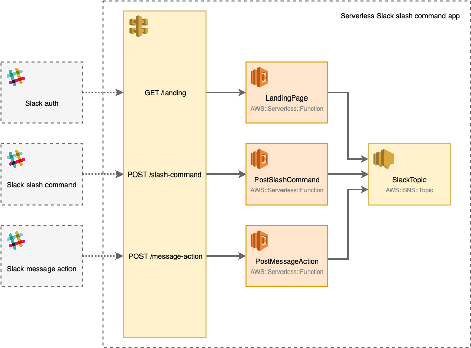
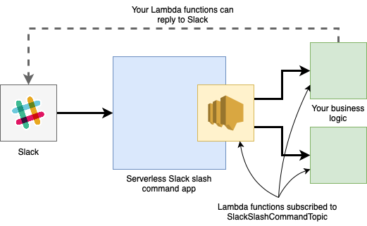

# Serverless Slack slash command app

Serverless application for Slack slash command and message actions.

## Infrastructure and architecture

By deploying this stack, you'll get the following infrastructure:

The main idea behind this serverless application is to reply immediately to Slack with status 200, and to post the data received from Slack slash command or message action to an SNS topic ("SlackTopic").

This stack exports the SNS topic. Export name is "SlackSlashCommandTopic."

## Integration

After deploying a serverless Slack slash command app, you should create one or more Lambda functions that are subscribed to "SlackSlashCommandTopic." These functions can process the input, implement the business logic and reply to Slack if needed.

High level overview of the integration should look like the following diagram:

### Example integration

TBA

## Installation

This application will be available on AWS Serverless Application Repository soon.

## Contribution

TBA

## License